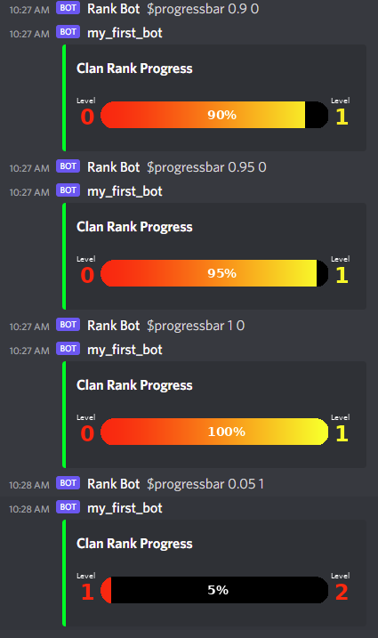

# roblox_discord_integration
A first attempt to integrate roblox with discord - specifically to have roblox automatically communicate level up progress to a discord community, including a fancy progress bar

## Background
I am part of the Roblox Unsquared community cenetered around their "Unbowing Simulator" game. On June 17th 2022, a new update is supposed to introduce a new team mechanic called Clans. Players have started to form unofficial unions prior to the launch, and discord serves as a social hub for clan pre-formation. The new clans are allegedly initally limited to 10 players, but we have been told that 5 more players can be added with each new clan rank (to a maxium rank of 9, or 50 players). We have no idea how long it will actually take to level up a clan, but we thought it might be helpful for our discord community members who are waiting to join a clan to have a progress bar external to the game so folks have an idea how long they have to wait.

## Purpose
The main idea is to have the game automatically send updates about clan level up progress to discord.

## Overview
I do not yet know how to manipulate images in lua, so I am using a double-hop to accomplish the visual image of the progress bar. First, Roblox sends a HTTPS post request to a disco webhook with the currently clan progress (expressed as a percentage) and current rank. Next, I have a second bot listening on the channel that watches for a command, in this case "$progressbar", with two parameters:
$progressbar 0.5 1

The sole purpose of the second bot is to draw the fancy progress bar.

Ideally, I could either have lua draw the progress bar directly, or have the roblox HTTPS post go directly to the python code listening on an independent server.

## Building the Roblox code
I do not know have access to the Unsquared simulator code, so I whipped up a dummy game that does nothing except wait for you to click, and then processes each click. Each click represents "progress" of the clan, with 100% being 20 clicks. I use the global table \_G to store the clicks and ranks - I have another demo using persistent storage, but it is very cumbersome and slow, and distracts from my goal of this demo.

Due to the client/server relationship enforced by Roblox, you have to send messages between the client and server. Furthermore, there are very specific ways to do that. I am using ModuleScripts in ReplicatedStorage to fire remoteEvents and remoteFunctions to the server. At this point, I do not need the server to communicate back to the client.

### StarterPlayer -> StarterPlayerScripts -> LocalScript
This is the runtime script that simply listens for a click event, and forwards it to a module script in ReplicatedStorage.

### ReplicatedStorage -> rankManager
The rankManager communicates with the server to manipulate the "global" variables (clicks and ranks), and to send the progress to the discord webhook.

rankManager gets the global clicks, adds 1. If less then 20, it simply fires off an event to the disco webhook. If >= 20, rankManager sends the appropriate message to the disco webhook, sets clicks back to 0, and increments ranks.

### ServerScriptService -> clickManager
All the clickManager does is allow replicatedStorage to interact with the global variables clicks and ranks.

### ServerScriptService -> NotifyDiscordLevelUp
This script merely forwards a formatted package to the discord webhook.

## Building the discord bot
demo_bot.py runs on a dedicated server (or one's own computer, if that works) - it is registered as a discord bot and listens for a specially formatted command. Once it hears the command in discord, it parses the contents (to get progress percent and ranks), then forms several images to represent a progress bar. Once the progress bar (and associated text) are drawn, the image is saved to disk, then attached as a HTTPS post back to discord to fully render in a channel.

# End Result

